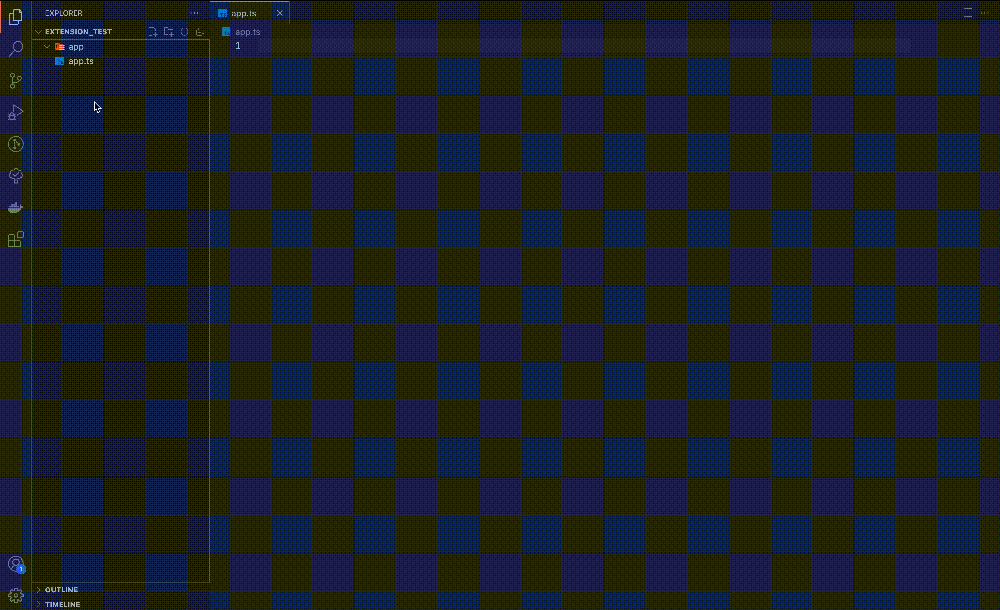

# React-files-generator

Automatically create folders and files in your React project.

## Features

Create file structure like this:

```bash
├── <given_name>
│   ├── index.ts
│   ├── <given_name>.styles.ts
│   ├── <given_name>.test.tsx
│   ├── <given_name>.tsx
│   └── <given_name>.types.ts
└──
```

#### How it works: demo



## Requirements

None

## Extension Settings

None for now

## Known Issues

None for now

## Release Notes

### 0.0.1

Implement basic version of extension which creates given files:

- index.ts
- <component_name>.styles.ts
- <component_name>.test.tsx
- <component_name>.tsx
- <component_name>.types.ts

## Contributors

- Klaudia Błażyczek (blazyczek.klaudia@gmail.com)

## Repository

https://github.com/Vesperalin/React-Files-Generator
